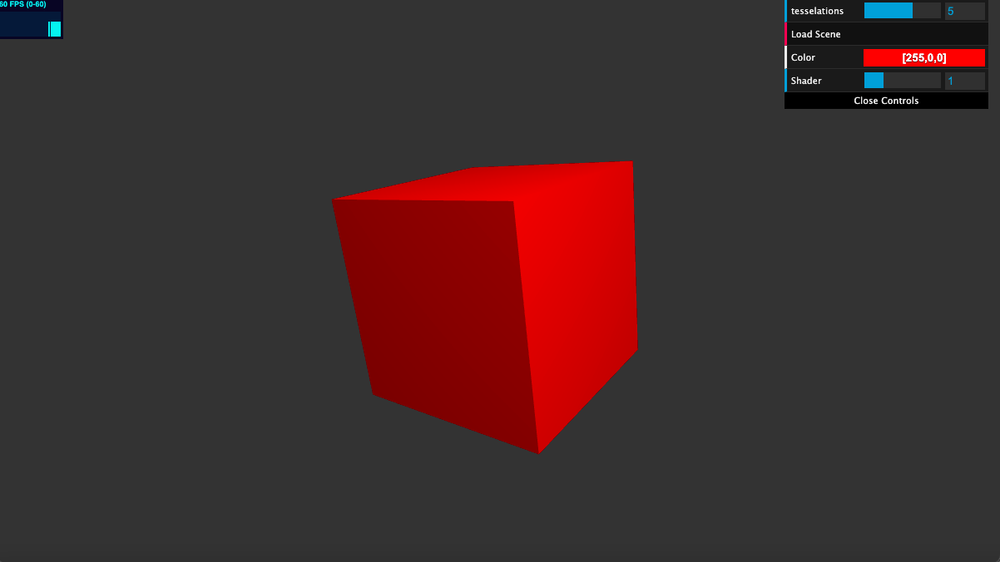
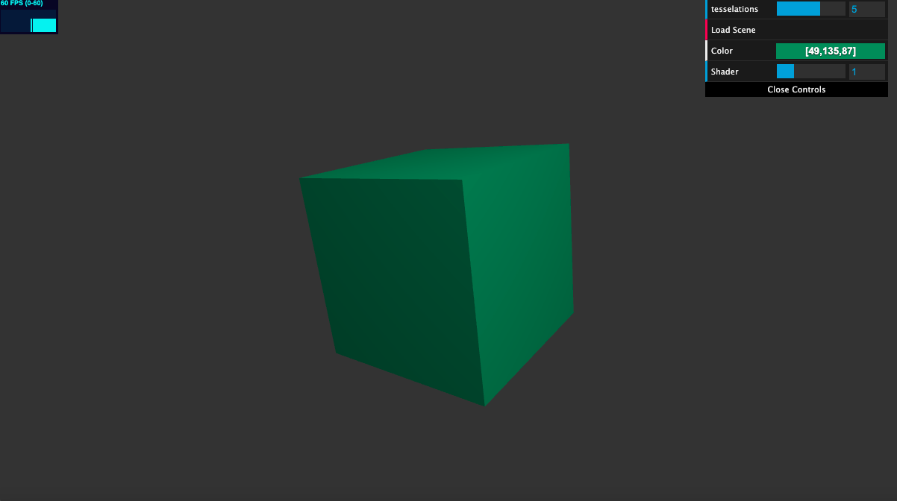
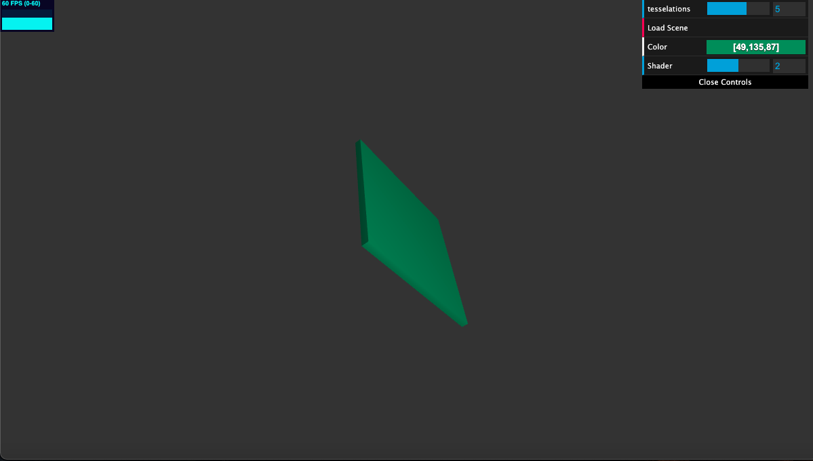
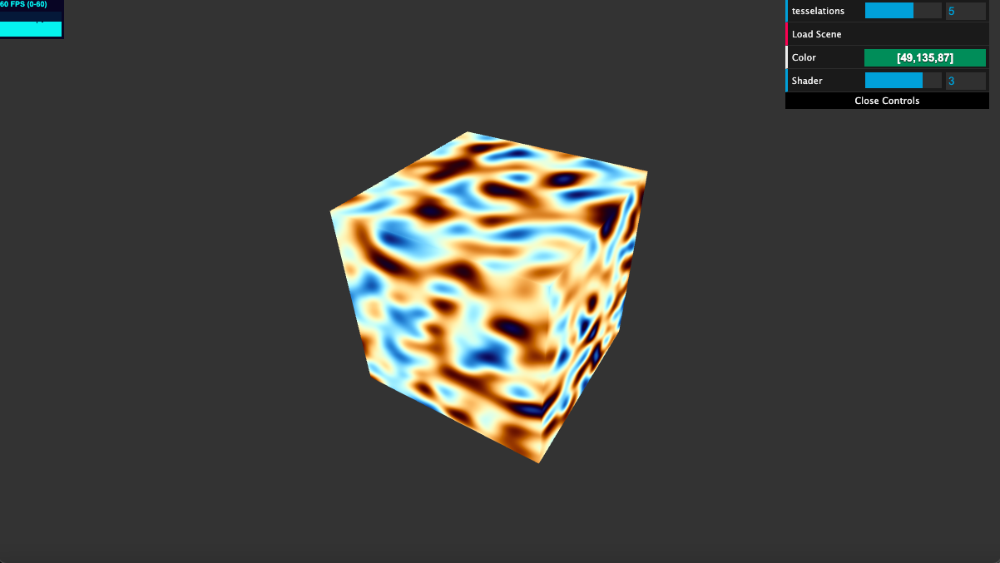

# HW 0: Noisy Planet Part 1 (Intro to Javascript and WebGL)

## Live Demo: https://eddieh80.github.io/hw00-webgl-intro/

## Project Description

Initially the scene only has a cube with lambert vertex and fragment shading. The code to render a sphere or square is currently commented out, but commenting/uncommenting elements in the geometry array for the render function can be used to change what geometry is rendered on the screen. Different shader combinations can be accessed by using the Shader slider, where 1 = lambert vertex + lambert fragment, 2 = deform vertex + lambert fragment, 3 = lambert vertex + noise fragment, and 4 = deform vertex + noise fragment. A different color for the lambert shading can be picked out using the color wheel. I used Perlin Noise plugged into a orange-blue cosine color palette for the custom noise fragment shader, using the fragment position as the input to the noise function. For the deformation vertex shader, I used a uniform time variable that is incremented everytime tick() is called and then used this time variable to interpolate between the default position of the geometry and an expanded version of the geometry, modifying each dimension with either sin or cos as well as varying the timing with sin and cos.

## Objective
- Check that the tools and build configuration we will be using for the class works.
- Start learning Typescript and WebGL2
- Practice implementing noise
